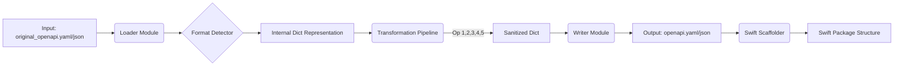

This is a comprehensive technical specification and implementation plan for the **OpenAPI-to-Swift CLI Utility**.

---

# Project Plan: Swift OpenAPI Bootstrapper

## 1. Executive Summary
This project is a Python-based CLI utility managed by `uv`. Its purpose is to bootstrap and maintain a Swift Package based on an OpenAPI specification. It acts as a middleware layer that sanitizes "imperfect" OpenAPI documents (JSON or YAML), applies specific fixes to make them compatible with strict Swift type generation, and scaffolds the necessary Swift Package Manager (SPM) infrastructure.

## 2. Technology Stack & Dependencies

We will use **Python 3.12+** managed by **`uv`**.

### Core Libraries
| Library | Purpose |
| :--- | :--- |
| **Typer** | Modern, type-safe CLI builder (replaces argparse/click). |
| **Rich** | Beautiful terminal formatting (colors, spinners, tables) for user feedback. |
| **PyYAML** | Robust parsing and emitting of YAML files (preserving structure). |
| **Jinja2** | Templating engine for generating `Makefile`, `.gitignore`, and config files. |
| **Pydantic** | Data validation and settings management (optional, but good for config). |
| **DeepDiff** | (Optional) useful for comparing schema changes if we add diffing logic later. |

### Development Tools
| Tool | Purpose |
| :--- | :--- |
| **uv** | Fast Python package installer and resolver. |
| **Ruff** | Linter and formatter. |
| **Pytest** | Testing framework. |

---

## 3. Architecture Overview

The application will follow a **Pipeline Architecture**. Data flows from the source file through a series of "Transformers" and results in file generation and shell execution.



---

## 4. Python Project Structure

The project will be structured to separate CLI logic, domain logic (transformations), and IO operations.

```text
swift-openapi-bootstrapper/
├── pyproject.toml          # Defined by uv
├── uv.lock
├── README.md
├── src/
│   └── bootstrapper/
│       ├── __init__.py
│       ├── main.py         # Entry point (Typer app)
│       ├── config.py       # Constants and configuration
│       ├── core/
│       │   ├── __init__.py
│       │   ├── loader.py   # Handles JSON/YAML loading
│       │   └── writer.py   # Handles JSON/YAML dumping
│       ├── transformers/
│       │   ├── __init__.py
│       │   ├── manager.py  # Orchestrates the operations
│       │   ├── ops_base.py # Base logic for recursive traversal
│       │   ├── op1_null_anyof.py
│       │   ├── op2_const_enum.py
│       │   ├── op3_nullable.py
│       │   ├── op4_format_fix.py
│       │   └── op5_clean_required.py
│       ├── generators/
│       │   ├── __init__.py
│       │   ├── swift.py    # Shell commands for Swift (package init, etc.)
│       │   └── templates.py # Jinja2 rendering logic
│       └── resources/      # Jinja2 templates
│           ├── Makefile.j2
│           ├── .gitignore.j2
│           ├── .env.example.j2
│           ├── openapi-generator-config.yaml.j2
│           └── overlay.json.j2
└── tests/
    ├── test_transformers.py
    └── test_integration.py
```

---

## 5. Implementation Details

### 5.1. CLI Entry Point (`src/bootstrapper/main.py`)
*   **Commands:**
    *   `bootstrap`: The primary command.
        *   **Arg:** `target_dir` (Path to the folder containing `original_openapi`).
*   **Logic:**
    1.  Initialize `rich.console`.
    2.  Check for `original_openapi.yaml` or `.json` in `target_dir`.
    3.  Call `transformers.manager.process_spec()`.
    4.  Call `generators.swift.ensure_package_structure()`.
    5.  Call `generators.swift.run_generator()`.

### 5.2. File I/O (`src/bootstrapper/core/`)
*   **`loader.py`**:
    *   Function: `load_spec(path: Path) -> (dict, FileFormat)`
    *   Detects extension. Uses `yaml.safe_load` or `json.load`.
    *   Returns the data as a Python dictionary and an enum indicating if it was YAML or JSON.
*   **`writer.py`**:
    *   Function: `write_spec(data: dict, path: Path, format: FileFormat)`
    *   Writes back to `openapi.yaml` or `openapi.json` matching the original format.
    *   *Crucial:* Ensure `PyYAML` is configured to avoid creating aliases (anchors) if Swift parser doesn't like them.

### 5.3. Transformation Pipeline (`src/bootstrapper/transformers/`)

We will implement a **Visitor Pattern** or a **Recursive Walker**. Since JSON schemas are nested recursive structures, we need a utility that walks every node.

*   **`manager.py`**:
    *   Chains the operations.
    *   Logic:
        ```python
        spec = loader.load()
        spec = Op1.apply(spec)
        spec = Op2.apply(spec)
        ...
        writer.save(spec)
        ```

*   **`ops_base.py`**:
    *   Contains a helper function `recursive_walk(data, callback)` that visits every dict and list in the structure, allowing specific transformation logic to modify nodes in place.

*   **Specific Operations:**

    *   **Operation 1 (`op1_null_anyof.py`)**:
        *   *Logic:* Iterate through all keys. If key is `anyOf`, check the list. If `type: "null"` exists, remove it. If `anyOf` has 1 item left, replace `anyOf` with that item. Check for `default: null` and remove it if the type is no longer nullable.

    *   **Operation 2 (`op2_const_enum.py`)**:
        *   *Logic:* Look for keys named `const`. If found, capture the value. Remove `const`. Add `enum: [value]`.

    *   **Operation 3 (`op3_nullable.py`)**:
        *   *Logic:* Check root `openapi` version. If < 3.1.0: Look for `nullable: true`. If found, remove `nullable: true`. Wrap the current type in a 3.1 style structure (e.g., `oneOf: [{type: original}, {type: null}]` or `type: [original, null]`). *Note: Swift OpenAPIGenerator prefers specific nullability patterns, we must ensure we output the one it likes.*

    *   **Operation 4 (`op4_format_fix.py`)**:
        *   *Logic:* Check root `openapi` version >= 3.1.0. Find `{type: string, format: byte}`. Change to `{type: string, contentEncoding: base64}`.

    *   **Operation 5 (`op5_clean_required.py`)**:
        *   *Logic:* This requires access to the parent object. When visiting a Schema Object, look at `properties` keys. Then look at `required` list. Filter `required` list: `[k for k in required if k in properties]`.

### 5.4. Generators & Scaffolding (`src/bootstrapper/generators/`)

#### 5.4.1 Template Manager
Uses `Jinja2` to generate files that don't exist yet.
*   **`overlay.yaml`**: Generate the minimal empty overlay if it doesn't exist.
*   **`openapi-generator-config.yaml`**: Generate two configs (one for Types, one for Client) to support the specific architecture requested.
*   **`Makefile`**: A robust Makefile encapsulating the `swift run` commands.
*   **`.env`**: Template for API keys.

#### 5.4.2 Swift Manager (`swift.py`)
This module wraps `subprocess.run`.

**Workflow:**
1.  **Check existence:** Is there a `Package.swift`?
2.  **If NO (First Run):**
    *   Run `swift package init --type library`.
    *   *Correction strategy:* Instead of running 10 separate `swift package add-dependency` commands (which can be slow and error-prone), we will generate the `Package.swift` content using a Jinja2 template that includes all the dependencies (Apple's OpenAPI runtime, AsyncHTTPClient, UsefulThings, etc.) and write it to disk. This is safer and cleaner.
3.  **Create Folder Structure:**
    *   Ensure `Sources/{ProjectName}Types` exists.
    *   Ensure `Sources/{ProjectName}Client` exists.
    *   (The default `init` creates one target; we need to restructure it to separate Types and Client as per the prompt's implied architecture).
4.  **Run Generation:**
    *   Execute the `generate-openapi` command (or call the specific `swift run` commands defined in the prompt's Makefile snippet).

---

## 6. End-Result: File Structure

After the script runs in a folder named `MyAPIWrapper`, the structure will look like this:

```text
MyAPIWrapper/
├── original_openapi.yaml         # User provided (Source of Truth)
├── openapi.yaml                  # Generated/Fixed by Python script
├── openapi-overlay.yaml          # Generated (User can edit)
├── openapi-generator-config.yaml # Generated
├── Package.swift                 # Generated/Managed
├── Makefile                      # Generated
├── .env                          # Generated (User fills this)
├── .gitignore                    # Generated
├── Sources/
│   ├── MyAPIWrapperTypes/        # Target 1
│   │   ├── GeneratedSources/     # Git-ignored, populated by tool
│   │   └── ...
│   └── MyAPIWrapperClient/       # Target 2
│       ├── GeneratedSources/     # Git-ignored, populated by tool
│       └── ...
└── Tests/
    └── MyAPIWrapperTests/
```

---

## 7. Configuration & Extensibility

*   **Updates:** When the user downloads a new `original_openapi.yaml` and runs the tool:
    1.  Tool detects existing files.
    2.  Re-runs Transformations -> Overwrites `openapi.yaml`.
    3.  Preserves `openapi-overlay.yaml` (so user manual fixes are kept).
    4.  Runs `swift-openapi-generator` which regenerates code in `GeneratedSources`.
    5.  User code in `Sources/MyAPIWrapperClient/MyClient.swift` (manual code) remains untouched.

---

## 8. Development Steps for the Developer

1.  **Setup:** `uv init swift-openapi-bootstrapper` and add dependencies (`typer`, `rich`, `pyyaml`, `jinja2`).
2.  **IO Layer:** Implement `loader.py` and `writer.py` to ensure perfect round-trip of JSON/YAML.
3.  **Transformers:** Implement `ops_base.py` (the walker) and `op1` through `op5` with unit tests for each case using snippets of broken OpenAPI specs.
4.  **Templating:** Create the `Jinja2` templates for `Package.swift` (with placeholders for package name) and the Configs.
5.  **CLI Orchestration:** Wire up `main.py` to accept the folder path.
6.  **Integration:** Test running the script in a dummy folder. Verify `swift package dump-package` allows valid parsing of the generated Package.swift.

## 9. Code Snippet: Transformation Skeleton

To aid the developer, here is how the transformation logic should look:

```python
# src/bootstrapper/transformers/ops_base.py

def recursive_walk(data, transform_func, parent=None, key_in_parent=None):
    """
    Traverses dict/list structures. 
    Applies transform_func(data, parent, key_in_parent) at every node.
    """
    # Apply transformation to current node
    data = transform_func(data, parent, key_in_parent)

    if isinstance(data, dict):
        # We must list keys because the loop might modify the dict
        for k in list(data.keys()):
            data[k] = recursive_walk(data[k], transform_func, parent=data, key_in_parent=k)
    elif isinstance(data, list):
        for i, item in enumerate(data):
            data[i] = recursive_walk(item, transform_func, parent=data, key_in_parent=i)
            
    return data
```

This plan provides a robust blueprint for building the tool using the best modern Python practices.

Based on the plan, here is the user manual for how a developer (the end-user) will interact with this tool.

Since we are using **`uv`**, the distribution and execution mechanism is extremely streamlined. The user does **not** need to clone the Python source code repository or manually manage virtual environments.

### 1. One-Time Setup

The user (likely a Swift developer) needs to have **`uv`** installed. They can install the tool globally on their machine directly from your repository (or PyPI if you publish it).

```bash
# Install the tool globally using uv
uv tool install git+https://github.com/your-username/swift-openapi-bootstrapper.git

# Verify it works
swift-bootstrapper --help
```

### 2. Scenario A: Creating a New Swift Package

The user wants to create a new Swift library called `MyStripeWrapper`.

**Step 1: Prepare the Folder**
The user creates a folder and drops their raw OpenAPI file into it.

```bash
mkdir MyStripeWrapper
cd MyStripeWrapper
# User copies their raw file here
cp ~/Downloads/stripe_api_v3.json ./original_openapi.json
```

**Step 2: Run the Bootstrapper**
The user runs the command inside the folder.

```bash
swift-bootstrapper .
```

**What happens on screen:**
*   (Spinner) "Analyzing original_openapi.json..."
*   (Checkmark) "Detected Format: JSON"
*   (Spinner) "Applying Transformations..."
    *   "Fixed 12 nullables in anyOf arrays"
    *   "Converted 5 consts to enums"
*   (Checkmark) "Written sanitized openapi.json"
*   (Checkmark) "Created empty openapi-overlay.json"
*   (Spinner) "Initializing Swift Package..."
*   (Checkmark) "Package.swift generated with dependencies"
*   (Spinner) "Running Swift OpenAPI Generator..."
*   **Success!** "MyStripeWrapper is ready. Open Package.swift to begin."

### 3. Scenario B: Updating the API (Maintenance)

Two months later, the API provider releases a new version.

**Step 1: Replace the file**
The user overwrites the original file.

```bash
cp ~/Downloads/stripe_api_v4.json ./original_openapi.json
```

**Step 2: Run the Bootstrapper again**
```bash
swift-bootstrapper .
```

**What happens:**
*   The tool detects that `Package.swift` and other config files already exist.
*   It **skips** `swift package init` (to protect project structure).
*   It **re-runs** the Python cleaning transformations on the new JSON file.
*   It **re-runs** `swift-openapi-generator` to update the generated Swift code.
*   Your manual code (extensions, helper logic) remains safe.

### 4. Scenario C: Fixing a Broken Schema (Overlays)

The user notices that the API documentation says the field `user_id` is required, but the generated Swift code treats it as optional (or vice versa), or a property is missing entirely.

**Step 1: Edit the Overlay**
The user opens the `openapi-overlay.json` file (which was created in Scenario A) and adds a fix.

```json
{
  "overlay": "1.0.0",
  "actions": [
    {
      "target": "$.components.schemas.User",
      "update": { "required": ["user_id"] }
    }
  ]
}
```

**Step 2: Run the Bootstrapper**
```bash
swift-bootstrapper .
```

**What happens:**
*   The tool applies the cleaning fixes to `original_openapi.json`.
*   It then applies the `openapi-overlay.json` on top of that.
*   It regenerates the Swift code.
*   The Swift code now correctly reflects `user_id` as required.

### 5. What the User Sees (File System)

After running the tool, the user's Finder/Explorer looks like this:

| File/Folder | Purpose |
| :--- | :--- |
| `original_openapi.json` | **Input:** The raw file they downloaded. |
| `openapi.json` | **Generated:** The clean version used by Swift. (Read-only). |
| `openapi-overlay.json` | **Input:** User manual fixes. |
| `Package.swift` | **Managed:** Defines dependencies. |
| `Makefile` | **Helper:** Contains shortcuts like `make generate`. |
| `.env` | **Config:** User puts their API key here for testing. |
| `Sources/` | **Code:** Contains the generated Swift code. |

### Summary of Commands

The user effectively only needs to know one command:

```bash
# Run this whenever inputs (original_openapi or overlay) change
swift-bootstrapper . 
```
